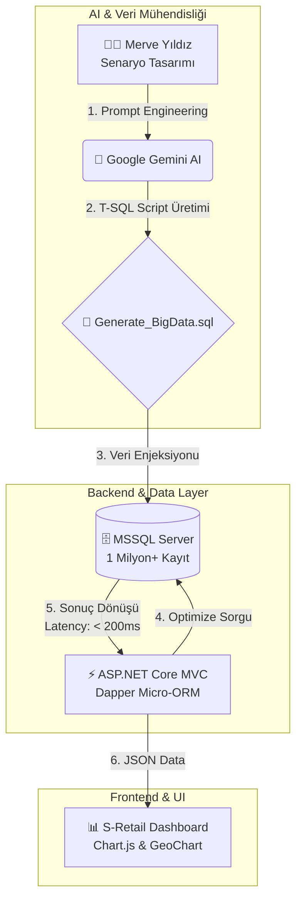

# 🛒 S-Retail: AI Destekli Stratejik Perakende Analiz Paneli

**S-Retail**, büyük ölçekli bir perakende zincirinin (Online + Fiziksel Mağaza) satış verilerini analiz etmek için geliştirilmiş, **Yapay Zeka destekli** ve performans odaklı bir yönetim panelidir.

Proje, klasik Entity Framework yavaşlığından kaçınarak **Dapper Micro-ORM** mimarisiyle, **1 Milyon+ satırlık** büyük veri setleri üzerinde milisaniyeler içinde sorgulama ve raporlama yapabilir.

---

### Süreç Detayları

1.  **🧠 Senaryo Tasarımı & Veri Mühendisliği:**
    * AI modeline (Gemini) Türkiye'deki gerçek perakende alışkanlıkları ve demografik yapı öğretildi.
    * *Sonuç:* İstanbul, Ankara gibi büyükşehirlerde satış yoğunluğunun artırılması, "Yaz" aylarında dondurma/giyim satışlarının artması gibi **Mevsimsellik ve Lokasyon** mantığı kurgulandı.

2.  **⚡ Sentetik Büyük Veri Üretimi (Synthetic Data Generation):**
    * Manuel veri girişi yerine, AI tarafından yazılan karmaşık **T-SQL Scriptleri** kullanıldı.
    * Bu scriptler sayesinde **1.000.000+** anlamlı, ilişkili ve analiz edilebilir satış kaydı saniyeler içinde veritabanına basıldı.

3.  **🚀 Backend Optimizasyonu & SQL Tuning:**
    * AI, performans darboğazı oluşturabilecek sorguları analiz ederek en optimize SQL sorgularını (Computed Columns, Indexing) önerdi.
    * Veri erişim katmanında **Dapper** kullanılarak EF Core'a göre **%400'e varan hız artışı** sağlandı.

4.  **🎨 UI/UX & Dashboard Tasarımı:**
    * Verilerin anlamlı bir hikayeye dönüşmesi için Google GeoChart ve Chart.js kütüphaneleri, AI desteğiyle modern "Admin Paneli" standartlarına göre uyarlandı.

---

## 📸 Proje Ekran Görüntüleri

| 🌍 Stratejik Dashboard | 🔎 Detaylı Veri Madenciliği |
|------------------------|-----------------------------|
| |  
|  |  |

---

## ✨ Temel Özellikler

### 1. Büyük Veri Yönetimi (Big Data Handling)
* Veritabanında **1 Milyon+** satır olmasına rağmen, "Server-Side Pagination" (Sunucu Taraflı Sayfalama) sayesinde sayfalar **0.2 saniyede** yüklenir.

### 2. Akıllı Perakende Metrikleri
* **Omnichannel Analizi:** Online (S-Online) ve Fiziksel Mağaza (Mega, Express) satışlarının karşılaştırılması.
* **Coğrafi Isı Haritası:** Türkiye haritası üzerinde il bazlı ciro yoğunluğu (İstanbul'un koyu turuncu yanması vb.).
* **Finansal KPI'lar:** Toplam Ciro, Sepet Ortalaması, Tahmini Net Kâr.

### 3. Gelişmiş Filtreleme Motoru
* Kullanıcılar milyonlarca kayıt arasından; **Fiş No, Ürün Adı, Fiyat Aralığı, Tarih ve Mağaza Formatına** göre anlık arama yapabilir.

---

## 🛠️ Teknoloji Yığını (Tech Stack)

* **Backend:** ASP.NET Core 6.0 MVC
* **Veritabanı:** MSSQL Server (SQL Scripts & Stored Procedures)
* **ORM:** Dapper (Micro-ORM)
* **Frontend:** Bootstrap 5, JavaScript, jQuery
* **Veri Görselleştirme:** Google Charts (GeoChart), Chart.js
* **Raporlama:** EPPlus (Excel Export)
* **AI Tools:** Google Gemini (Prompt Engineering & Data Simulation)

## 🚀 Kurulum Adımları

1.  Repoyu klonlayın.
2.  `appsettings.json` içindeki bağlantı cümlesini düzenleyin.
3.  **Database** klasöründeki `Generate_BigData.sql` dosyasını çalıştırın (Bu script AI tarafından üretilen 1 milyon veriyi basacaktır).
4.  Projeyi başlatın.

## 👤 Geliştirici & Katkıda Bulunanlar

**Merve Yıldız** - *Lead Developer*
* [LinkedIn](https://www.linkedin.com/in/aysemerveyildiz/)
* [GitHub](https://github.com/AyseMerveYildiz/DapperRetailSalesProject)

**Google Gemini** - *AI Pair Programmer*
* *Rolü:* Veri simülasyonu, SQL optimizasyonu ve kod refactoring desteği.
## 🤖 AI Destekli Geliştirme İş Akışı (Human-AI Collaboration)

Bu proje, **Developer (Merve Yıldız)** ve **AI Pair Programmer (Google Gemini)** işbirliği ile geliştirilmiştir. Kodlamanın ötesinde, bir veri simülasyonu ve iş zekası senaryosu kurgulanmıştır.

### 🧠 Nasıl Çalışır? (Teknik Mimari & AI Akışı)

Projenin veri üretiminden son kullanıcıya ulaşan teknik yolculuğu aşağıdaki gibidir:

---
*Bu proje, yapay zeka destekli sentetik veri üretimi ve yüksek performanslı veri işleme yeteneklerini sergilemek amacıyla geliştirilmiştir.*
